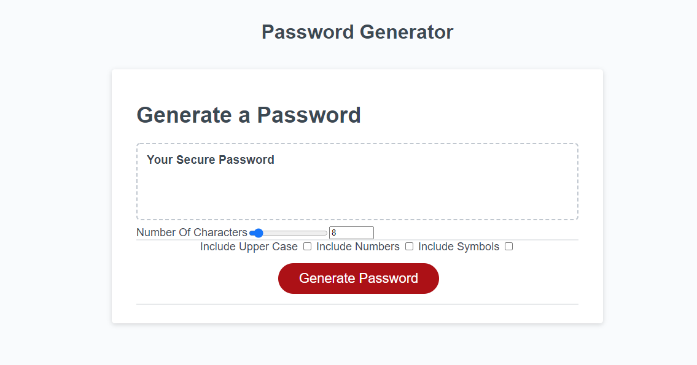

this is my shot at the password generator assignment.

I think i did fairly well however I did have issues with my initial upload so I held off until I had completed all the code.

I tried using checkboxes and slider bars for my prompts as I dislike the asthetic and in your face-ness of alert prompts and I enjoy this interface more.

I also will spend more time fixing the slider bar when I think that the time spent will give more improvement.

Never.Stop.Coding.